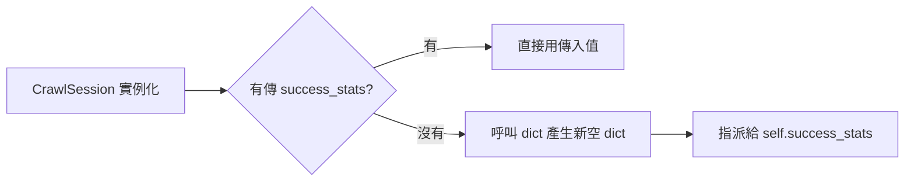
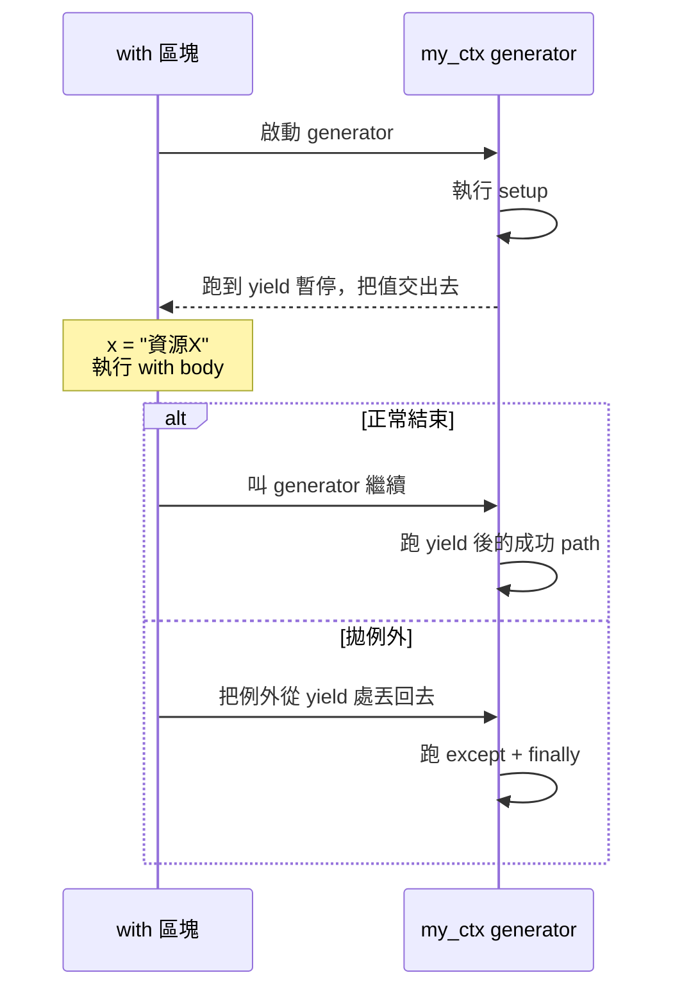

# Python 語法主題：dataclass field、ClassVar、yield + contextmanager（2026-04-29）

> 從 [src/food_data_ingestion/services/ingestion_context.py](../../src/food_data_ingestion/services/ingestion_context.py) 衍生出的 Python 語法討論整理。

---

## 1. `dataclass` 的 `field(default_factory=...)`

### 來源程式碼
```python
@dataclass
class CrawlSession:
    job_id: int
    source_target_id: int | None
    success_stats: dict[str, Any] = field(default_factory=dict)
    failure_stats: dict[str, Any] = field(default_factory=dict)
    error_prefix: str = "parser_error"
```

### 核心觀念
`field()` 是 `dataclasses` 提供的「欄位設定函式」。`default_factory=dict` 表示「**每個 instance 建立時呼叫一次 `dict()` 產生新空 dict 當預設值**」。

### 為什麼不能 `= {}`
dataclass 禁止可變物件當 default，會直接 `ValueError: mutable default ... is not allowed`。理由：經典 mutable default 陷阱：

```python
class Bad:
    def __init__(self, stats={}):   # 同一個 dict 被所有 instance 共用！
        self.stats = stats

a, b = Bad(), Bad()
a.stats["x"] = 1
print(b.stats)   # {'x': 1}  ← b 也被改到
```

### `default_factory` 等價手寫
```python
def __init__(self, ..., success_stats=None):
    self.success_stats = dict() if success_stats is None else success_stats
```

### 流程


### `field()` 速查
| 參數 | 用途 | 範例 |
|---|---|---|
| `default` | 不可變預設值 | `field(default=0)` |
| `default_factory` | 可變/動態預設值 | `field(default_factory=list)` |
| `init` | 是否進 `__init__` | `field(init=False)` |
| `repr` | 是否出現在 `__repr__` | `field(repr=False)` |
| `compare` | 是否參與 `==` / 排序 | `field(compare=False)` |
| `metadata` | 自訂中繼資料 | `field(metadata={"json": "snake_case"})` |

注意：`default` 與 `default_factory` 不能同時指定。

### 為什麼 `CrawlSession` 用它
`success_stats` / `failure_stats` 在 `crawl_session()` 內會被 mutate。每次 `with ctx.crawl_session(...) as session:` 必須拿到**乾淨且獨立**的 dict，否則上一輪統計會殘留 → 跨 job 資料污染。

### 規則記憶
> **immutable 用 `default`，mutable 用 `default_factory`。**

---

## 2. 「所有 instance 共用」的寫法：`ClassVar`

### 純 Python class（class 屬性）
```python
class Counter:
    shared: dict = {}          # class 屬性，所有 instance 共用

    def __init__(self, name):
        self.name = name        # instance 屬性

a, b = Counter("a"), Counter("b")
a.shared["x"] = 1
print(b.shared)   # {'x': 1}  ← 共用
```

陷阱：`a.shared = {...}`（**重新指派**）會在 a 建立 instance 屬性遮蔽 class 屬性，b 看不到。共用只在 mutate 時成立。

### `@dataclass` 寫法：用 `ClassVar`
dataclass 預設把每個有型別註記的欄位當 instance 欄位。要讓某欄位「不進 `__init__`、共用一份」要用 `typing.ClassVar`：

```python
from dataclasses import dataclass
from typing import ClassVar, Any

@dataclass
class CrawlSession:
    job_id: int
    source_target_id: int | None

    GLOBAL_STATS: ClassVar[dict[str, Any]] = {}   # 共用，不會進 __init__
```

### 三種寫法對照
```python
@dataclass
class Demo:
    a: dict = field(default_factory=dict)         # 每 instance 獨立
    b: ClassVar[dict] = {}                         # 全 class 共用
    c: dict = field(default_factory=lambda: Demo.b)  # 每 instance 持有「指向同一 dict 的參照」
```

| 寫法 | 預設值 | 共用？ | 何時用 |
|---|---|---|---|
| `field(default_factory=dict)` | 每次 new 一個 | 否 | 99% 情境 |
| `ClassVar[dict] = {}` | 一份共用 | 是 | 全域 cache、計數器、constant 表 |
| `= 0`、`= "x"`、`= None` | 不可變值 | N/A | 一般純量 |

### 警告
1. 可變 class 屬性常是 bug 來源（test 之間互相污染）
2. 多執行緒共用 dict 要自己加 lock
3. 長壽命 process 的 class cache 要避免無限長大
4. 想 immutable 共用，用 `tuple` / `frozenset` / `types.MappingProxyType`

### 規則記憶
> - 每 instance 獨立 → `field(default_factory=...)`
> - 全 class 共用 → `ClassVar[...] = ...`
> - 共用且想防改 → `MappingProxyType` / `tuple` / `frozenset`

---

## 3. `yield` + `@contextmanager`

### 為什麼要學這個
`crawl_session()` 整支函式靠它運作。讀懂它 = 讀懂 ingestion 架構的 lifecycle 管理。

### 先打地基：`with` 語法的本質
`with foo() as x:` = 「進入時做 A、離開時保證做 B」的語法糖。要求 `foo()` 回傳有 `__enter__` / `__exit__` 的物件 — 這叫 **context manager protocol**。

### 老派寫法（class）
```python
class MyCtx:
    def __enter__(self):
        print("setup")
        return "資源X"
    def __exit__(self, exc_type, exc_val, tb):
        print("teardown")

with MyCtx() as x:
    print("body got", x)
```

囉嗦：要寫 class、setup / teardown 被切成兩個方法。

### `@contextmanager` 寫法（捷徑）
用一個函式搞定，setup / teardown 寫在一起：

```python
from contextlib import contextmanager

@contextmanager
def my_ctx():
    print("setup")
    yield "資源X"           # ← 暫停！把 "資源X" 交給 with as
    print("teardown")       # ← with 結束後從這裡繼續

with my_ctx() as x:
    print("body got", x)
```

規則：函式內**只能有一個 `yield`**，當分隔線：
- yield **之前** = setup（`__enter__`）
- yield **的值** = `as` 收到的東西
- yield **之後** = teardown（`__exit__`）

### 控制流（最關鍵）


### 處理例外：try / finally
例外會**從 yield 那行重新丟進來**，要保 teardown 一定跑就用 `try/finally`：

```python
@contextmanager
def my_ctx():
    print("setup")
    try:
        yield "資源X"
    except Exception:
        print("失敗 path")
        raise               # 不要吃掉例外
    else:
        print("成功 path")
    finally:
        print("一定會跑")
```

### 對照 `crawl_session`
```python
@contextmanager
def crawl_session(self, ...):
    # ── A. setup（with 進入時跑）──
    job_id = ...create(...)
    ...mark_running(job_id, ...)
    self.transaction_manager.commit()
    if not lock_acquired:
        ...mark_skipped(...); commit(); raise CrawlLockedError(...)  # setup 階段 raise → with 進不去

    session = CrawlSession(...)
    try:
        yield session                              # ← B. with as session
        # ── C. 成功 path ──
        ...mark_success(job_id, ...); commit()
    except Exception as exc:
        # ── D. with body 拋例外 ──
        rollback(); ...mark_failed(...); commit(); raise
    finally:
        # ── E. 一律會跑 ──
        if lock_acquired: ...release(...)
```

| 區塊 | 等價 class 的哪裡 | 何時跑 |
|---|---|---|
| A | `__enter__` 主體 | with 進入時 |
| `yield session` | `__enter__` 的 return | 立刻交給 `as` |
| C | `__exit__` 中 `exc_type is None` | body 沒 raise |
| D | `__exit__` 中 `exc_type is not None` | body raise 時 |
| E | `__exit__` 一律執行部分 | 一律 |

### 為什麼用這寫法（vs 呼叫端自己 try/finally）
讓**呼叫端只關心業務**，lifecycle 集中管理：

```python
# 呼叫端只寫業務
with ctx.crawl_session(...) as session:
    raw_id = ctx.store_raw_from_fetch(fetch_result, crawl_job_id=session.job_id)
    session.success_stats["raw_document_count"] = 1
```

所有來源（candylife、supertaste、google_places）**共用一份 lifecycle**，不必每個 flow 重抄 try/except/finally。

### 三個易錯點
1. **必須恰好一次 `yield`**：超過一次 → `RuntimeError: generator didn't stop`
2. **要 raise 還是吃掉例外**：`except` 後沒 `raise` 等於吞掉，with 外面看不到
3. **setup 階段例外**：發生在 yield 之前 → with body 根本不會跑，從 `with` 那行直接往外噴（如 `CrawlLockedError`）

### 與 PHP `yield` 對照
| 場景 | Python | PHP |
|---|---|---|
| 基本 generator 迭代 | 一樣 | 一樣 |
| 製作 context manager | `@contextmanager` + 單一 `yield` | 沒有對應，要自己寫 class 或 closure helper |
| 資源清理慣用作法 | `with ...:` | `try/finally` 或 `DB::transaction(fn() => ...)` |

### 最小可跑範例（複製進 REPL 測試用）
```python
from contextlib import contextmanager

@contextmanager
def session(name):
    print(f"[setup] open {name}")
    try:
        yield {"name": name, "ops": 0}
        print(f"[ok] commit {name}")
    except Exception as e:
        print(f"[fail] rollback {name}: {e}")
        raise
    finally:
        print(f"[done] close {name}")


with session("A") as s:
    s["ops"] += 1
    print("body work, s =", s)

print("---")

try:
    with session("B") as s:
        raise ValueError("bang")
except ValueError:
    print("外面接到例外")
```

預期輸出：
```
[setup] open A
body work, s = {'name': 'A', 'ops': 1}
[ok] commit A
[done] close A
---
[setup] open B
[fail] rollback B: bang
[done] close B
外面接到例外
```

A 的流程 = `crawl_session` 的 mark_success path；B 的流程 = mark_failed path。

### 規則記憶
> `@contextmanager` + `yield` = **「把 setup / teardown 寫在同一個函式、用 `yield` 當分隔線、外部用 `with` 就自動跑」**。
>
> `yield X` 一行做三件事：①暫停 ②把 X 交給 `as` ③等 with 結束後從這裡繼續（並可能被丟回例外）。

---

## 附錄：跨主題對照表

| 主題 | 關鍵字 | 解決什麼問題 |
|---|---|---|
| `field(default_factory=...)` | dataclass 可變預設值 | 避免所有 instance 共用同一個 mutable 物件 |
| `ClassVar[T] = ...` | dataclass class 級欄位 | 想要刻意共用一份時的正確寫法 |
| `@contextmanager` + `yield` | setup/teardown 集中管理 | 讓 `with` body 只關心業務、生命週期一致 |
