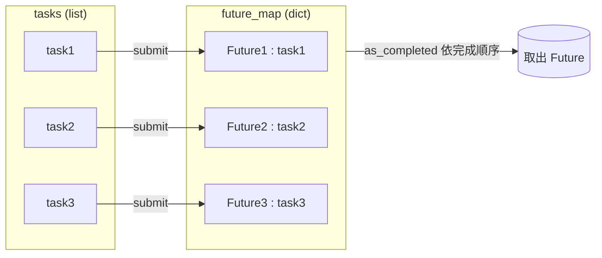
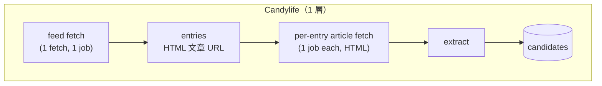
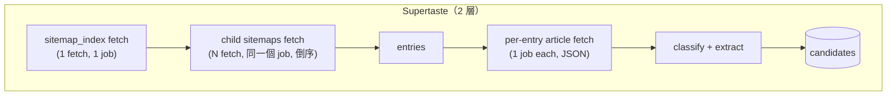
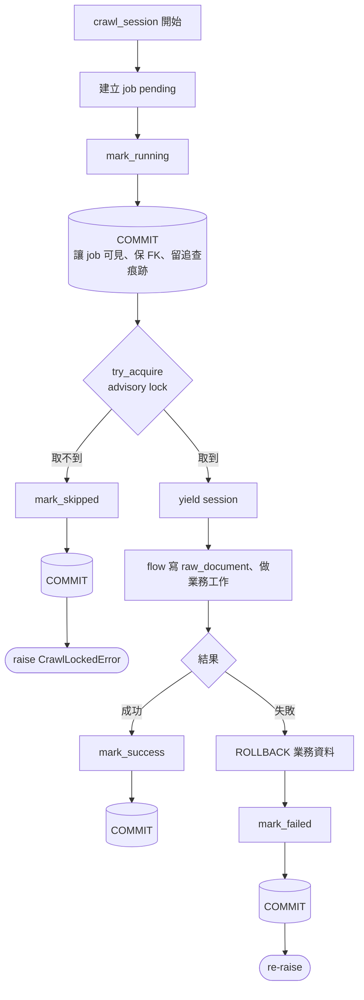

# food-data-ingestion 研讀筆記（2026-04-29）

> 對象：[src/food_data_ingestion/jobs/run_discovery.py](../../src/food_data_ingestion/jobs/run_discovery.py) 為入口的 discovery pipeline
> 整理一連串「程式碼閱讀問題」與對應解答，包含心智模型、流程圖與範例程式。

---

## 1. 從哪裡開始讀 `run_discovery.py`

### 建議閱讀順序
1. 模組頂端 docstring（定位）
2. `main()`（入口、整體流程）
3. `_resolve_platforms()`（防呆）
4. `_resolve_targets()`（任務從哪來）
5. `_run_one()`（每個 worker 的內容）
6. 最後回頭看 imports

### 心智模型
1. `main()` 收 CLI 參數
2. `_resolve_platforms()` 決定要跑哪些平台
3. `_resolve_targets()` 產生 task 清單
4. `ThreadPoolExecutor` 平行呼叫 `_run_one()`
5. `_run_one()` 內：建 adapter → 視需要建 DB connection → `adapter.run(...)` → commit/rollback → 回傳結構化結果
6. `main()` 彙總、輸出 JSON、決定 exit code

### 4 個必抓重點問題
| 問題 | 答案位置 |
|---|---|
| 任務從哪來？ | `_resolve_targets()` |
| 平行度怎麼決定？ | `max_workers = max(1, min(args.max_workers, len(tasks)))` |
| 失敗會中斷全部嗎？ | 不會，`_run_one()` 把 exception 轉成 failed result |
| 整體成功怎麼判定？ | `failed_count == 0` 才回 0 |

---

## 2. `_resolve_targets()` 為什麼要讀 DB

```python
rows = SourceTargetRepository(PsycopgSession(connection)).list_enabled(
    platforms=platforms,
    exclude_ids=exclude_ids,
)
```

讀 `ingestion.source_targets` 取得「**要跑哪些 target + 每個 target 的完整設定（crawl_policy、region、language、priority、source_meta…）**」。

理由：
1. runner 是統一入口，要先決定任務清單才能平行執行
2. 動態配置放在 DB，**不改程式就能調整**
3. 同時套用 CLI 篩選（`--platform`、`--exclude-source-target-id`）
4. 沒指定 `--write-db` 時不會走到這裡（前面已用 stub task 直接 return）

---

## 3. `PsycopgSession` 是什麼

定位：**「dict 化的 SQL 介面 + transaction 開關」**

職責：
- 包裝 psycopg v3 connection
- 提供 `fetchone / fetchall / execute / execute_returning`
- 提供 `commit / rollback`，當作 transaction 邊界

設計重點：所有 repo 共用同一個 `PsycopgSession` → 同一個 connection → 才能在同一 transaction 內提交/回滾。

```python
session = PsycopgSession(connection)
return {
    "session": session,                                 # 兼任 transaction_manager
    "raw_repository": RawDocumentRepository(session),
    "candidate_repository": ...(session),
    ...
}
```

repo 透過 `SessionProtocol` 認得它，測試時可塞 `MagicMock`。

---

## 4. ThreadPoolExecutor / `task` / `future_map`

### task
`_resolve_targets()` 產生的「一筆要做的工作」：
```python
{"platform": "candylife",  "source_target": None}
{"platform": "candylife",  "source_target": {"id": 7, "crawl_policy": {...}, ...}}
```

### `executor.submit(...)`
把函式呼叫排進 thread pool，**立即回傳 `Future`**（取貨單），不等執行完成。

### future_map
是一個 dict：`{ Future: task, ... }`



用途：`as_completed` 給你 Future（順序不可預測），靠 `future_map[future]` 反查回原 task。

### 慣用模板
```python
with ThreadPoolExecutor(max_workers=N) as ex:
    fmap = {ex.submit(_run_one, **t): t for t in tasks}
    for fut in as_completed(fmap):
        original_task = fmap[fut]   # 反查
        result = fut.result()       # 取結果（或 raise worker 內 exception）
```

---

## 5. `sum(1 for r in results if r["status"] == "success")`

等價於：
```python
total = 0
for r in results:
    if r["status"] == "success":
        total += 1
```

口訣：**「對每筆，符合條件就丟一個 1 出來，sum 把它們加起來。」**

---

## 6. Python 的 `...`（Ellipsis）

在 `Protocol` 方法定義裡：
```python
def run(self, *, source_target, deps) -> dict: ...
```

代表 **「方法簽章佔位符」**，等同於：
- Java `interface { X run(...); }`
- TypeScript `interface { run(...): X }`
- Go `interface { Run(...) X }`

其他常見場合：
| 場景 | 例子 |
|---|---|
| Stub / Protocol body | `def f() -> int: ...` |
| Callable 任意參數 | `Callable[..., int]` |
| NumPy 多維索引 | `arr[..., 0]` |
| 「待實作」標記 | `def todo(): ...`（不會 raise） |

---

## 7. Python `Protocol`：「實作」沒有 implements 關鍵字

`CandylifeDiscoveryAdapter` 看起來沒有寫 `implements DiscoveryAdapterProtocol`，但仍被視為實作 protocol。原因：**Python 用 structural typing（duck typing），方法簽章相符就算實作。**

| 語言 | 實作方式 |
|---|---|
| Java / C# | 顯式 `implements` / `:` |
| TypeScript | 兩者都支援 |
| Go / Python Protocol | 完全 structural |

驗證有實作的 4 種方式：
1. factory 的回傳型別註記
2. runner 只用 protocol 定義的方法
3. 跑 mypy / pyright 靜態檢查
4. 加 `@runtime_checkable` 後可用 `isinstance`

---

## 8. Pylance 警告：型別宣告太窄案例

```python
connector = CandylifeConnector(
    cache_repository=cache_repository,
    fetcher=fetcher if isinstance(fetcher, CandylifeLiveFetcher) else _FetcherAdapter(fetcher),
)
```

警告來自 `CandylifeConnector.__init__`：
```python
fetcher: CandylifeLiveFetcher | None = None   # ← 太窄
```
但實際會傳入 `_FetcherAdapter`。

**這是真實的型別不一致，不是 IDE 誤報。** 兩個解法：

### A. 用 Protocol 描述真正契約（推薦）
```python
class CandylifeFetcherProtocol(Protocol):
    def fetch_feed(self, url: str | None = None) -> str: ...
    def fetch_html(self, url: str) -> str: ...

# 然後
fetcher: CandylifeFetcherProtocol | None = None
```

### B. 放寬到 `Any`（不建議）

---

## 9. Supertaste vs Candylife 流程差異

### 來源型態對照
| 項目 | Candylife | Supertaste |
|---|---|---|
| 入口 | RSS Feed (XML) | Sitemap Index (XML) → child sitemaps |
| 文章內容 | HTML | JSON API |
| 發現結構 | feed → article（一層） | index → child sitemap → article（兩層） |
| 文章分類時機 | feed 階段就決定 `article_kind` | article 階段才用 `classify_article_kind(category, title)` |
| candidate 抽取規則 | 受 policy 控制 | 一律抽 `info_card_app` |

### 兩條 pipeline 圖





### 重點差異
1. **發現層數**：Candylife 1 層、Supertaste 2 層。
2. **crawl_job 開幾個**：Supertaste 整個 sitemap 階段共用一個 job（避免 fan-out 灌爆 job 表）。
3. **內容格式**：HTML vs JSON。
4. **Sitemap 倒序處理**：Supertaste 特有，因為 `article_sitemap_1` 是最舊歸檔，反轉後先處理新文章可大幅提高 candidate 產出。

### 程式檔案索引

#### 共用層
- [src/food_data_ingestion/services/ingestion_context.py](../../src/food_data_ingestion/services/ingestion_context.py)
- [src/food_data_ingestion/discovery/adapter.py](../../src/food_data_ingestion/discovery/adapter.py)
- [src/food_data_ingestion/discovery/registry.py](../../src/food_data_ingestion/discovery/registry.py)
- [src/food_data_ingestion/discovery/sources/_shared.py](../../src/food_data_ingestion/discovery/sources/_shared.py)
- [src/food_data_ingestion/discovery/service.py](../../src/food_data_ingestion/discovery/service.py)
- [src/food_data_ingestion/jobs/run_discovery.py](../../src/food_data_ingestion/jobs/run_discovery.py)

#### Candylife
- [src/food_data_ingestion/discovery/sources/candylife.py](../../src/food_data_ingestion/discovery/sources/candylife.py)
- [src/food_data_ingestion/services/candylife_ingestion.py](../../src/food_data_ingestion/services/candylife_ingestion.py)
- [src/food_data_ingestion/connectors/candylife.py](../../src/food_data_ingestion/connectors/candylife.py)
- [src/food_data_ingestion/parsers/candylife_feed.py](../../src/food_data_ingestion/parsers/candylife_feed.py)
- [src/food_data_ingestion/parsers/candylife.py](../../src/food_data_ingestion/parsers/candylife.py)
- [src/food_data_ingestion/parser_profiles/candylife.py](../../src/food_data_ingestion/parser_profiles/candylife.py)

#### Supertaste
- [src/food_data_ingestion/discovery/sources/supertaste.py](../../src/food_data_ingestion/discovery/sources/supertaste.py)
- [src/food_data_ingestion/services/supertaste_ingestion.py](../../src/food_data_ingestion/services/supertaste_ingestion.py)
- [src/food_data_ingestion/connectors/supertaste.py](../../src/food_data_ingestion/connectors/supertaste.py)
- [src/food_data_ingestion/parsers/supertaste_sitemap.py](../../src/food_data_ingestion/parsers/supertaste_sitemap.py)
- [src/food_data_ingestion/parsers/supertaste.py](../../src/food_data_ingestion/parsers/supertaste.py)
- [src/food_data_ingestion/parser_profiles/supertaste.py](../../src/food_data_ingestion/parser_profiles/supertaste.py)

---

## 10. `IngestionContext.crawl_session()` 內的關鍵程式

### 開場 12 行：建 job → mark_running → commit
```python
now = self.now_provider()
job_id = self.crawl_job_repository.create(
    CrawlJobCreate(
        platform=platform,
        job_type=job_type,
        source_target_id=source_target_id,
        request_meta=dict(request_meta or {}),
    )
)
self.crawl_job_repository.mark_running(job_id, started_at=now)
if self.transaction_manager is not None:
    self.transaction_manager.commit()
```

### `crawl_job_repository.create(CrawlJobCreate(...))` 的拆解
- `CrawlJobCreate(...)`：**純資料載體**（dataclass，不碰 DB），定義在 [src/food_data_ingestion/models/crawl_job.py](../../src/food_data_ingestion/models/crawl_job.py)。
  ```python
  @dataclass(frozen=True)
  class CrawlJobCreate:
      platform: str
      job_type: str
      ...
      def __post_init__(self):
          if self.status not in CRAWL_JOB_STATUSES:
              raise ValueError(f"無效的 crawl job 狀態：{self.status}")
  ```
- `crawl_job_repository.create(payload)`：實作在 [src/food_data_ingestion/storage/crawl_job_repository.py](../../src/food_data_ingestion/storage/crawl_job_repository.py)，跑 `INSERT ... RETURNING id`。

設計：**model 純資料、repo 負責讀寫**（測試容易、實作可換）。

### `mark_running` 真的會跑這段 SQL
```sql
UPDATE ingestion.crawl_jobs
SET status = 'running',
    started_at = %s,
    worker_name = %s,
    attempt_count = attempt_count + 1,
    updated_at = NOW()
WHERE id = %s
```

### 為什麼 mark_running 後要立刻 `commit()`
1. **讓「我已經在跑這個 job」立即可被別的 process / worker 看見**（PG 預設 isolation 下未 commit 不可見）
2. **保證 raw_documents.crawl_job_id 的 FK 能滿足**（`_shared.py` 註解明寫）
3. **process 突然死掉時仍留有「曾經 running」的痕跡**，可事後追查/補救

### 整支 crawl_session 的 4 個 commit 點
| 位置 | 用途 |
|---|---|
| mark_running 後 | job 立即可見 + 保 FK + 留追查痕跡 |
| try_acquire 失敗 / mark_skipped 後 | 讓 skipped 紀錄落地 |
| yield 成功完成 / mark_success 後 | 提交 success + stats |
| except / mark_failed 後 | 業務資料 rollback、但 mark_failed 自己要 commit |

口訣：**「每改 crawl_job 狀態都要 commit，因為 job lifecycle 是獨立可觀察事件，不能跟業務資料的 transaction 綁死。」**

### 流程總圖



---

## 附錄 A：跨主題對照表（速查用）

| 主題 | 關鍵字 | 相關檔案 |
|---|---|---|
| 入口 | `main()`, `ThreadPoolExecutor` | jobs/run_discovery.py |
| Adapter 介面 | `Protocol`, `...` | discovery/adapter.py |
| Adapter 實作 | structural typing | discovery/sources/{candylife,supertaste}.py |
| Flow class | `crawl_session()` | services/{candylife,supertaste}_ingestion.py |
| Orchestration | `IngestionContext` | services/ingestion_context.py |
| 資料模型 | `dataclass(frozen=True)` | models/ |
| Repo + DB | `PsycopgSession`, `SessionProtocol` | db/, storage/ |

---

## 附錄 B：自我驗證練習

```bash
# 1. 用 stub 跑單一平台
python -m food_data_ingestion.jobs.run_discovery --platform candylife --use-stub-fetcher

# 2. 多平台並行
python -m food_data_ingestion.jobs.run_discovery --max-workers 2

# 3. 防呆測試
python -m food_data_ingestion.jobs.run_discovery --platform not_exist
```
